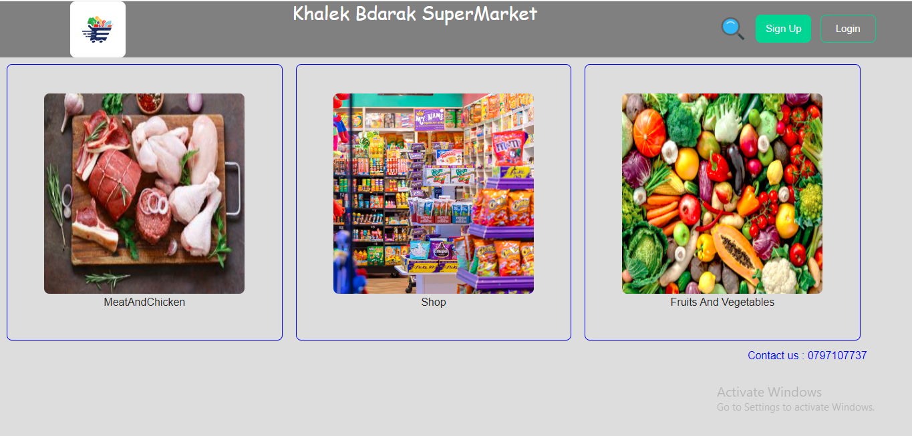
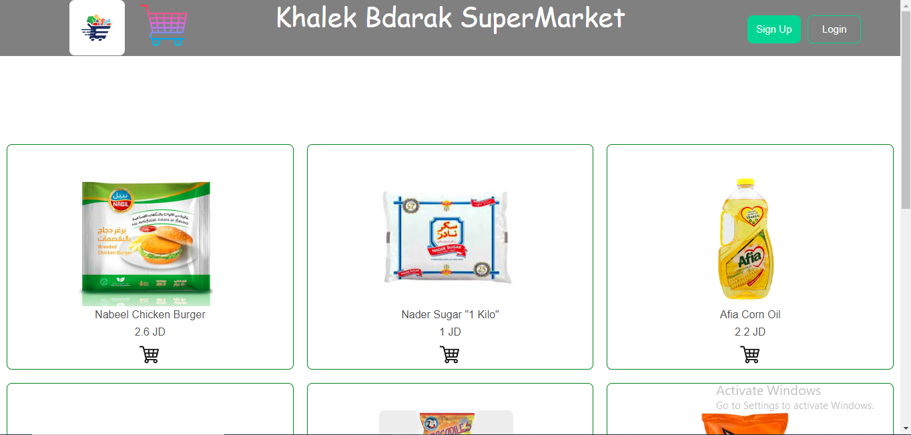
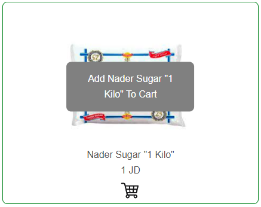

<p align="center">
<a href="https://www.meraki-academy.org" target="_blank" rel="noopener noreferrer">
 
 </a>
</p>

<h3 align="center">Khalek Bdarak SuperMarket
</h3>

---

<p align="center"> One of the most points that made the restaurants be successful in Jordan is that they  have delivery , soo costumers don't have to get out of their homes to get their food.
What about superMarkets ? why dont they have deleviry?
Lets make the life easier for costumers and make a delivery for SuperMarkets. 
    <br> 
    
</p>

## 📝 Table of Contents

- [📝 Table of Contents](#-table-of-contents)
- [🧐 About ](#-about-)
- [🏁 Getting Started ](#-getting-started-)
  - [Prerequisites](#prerequisites)
  - [Installing:](#installing)
- [🎈 Usage ](#-usage-)
- [⛏️ Built Using ](#️-built-using-)
- [User Story ](#user-story-)
- [Data Flow ](#data-flow-)
- [⚠️ Guided By ](#️-guided-by-)

## 🧐 About <a name = "about"></a>
This webSite will make your life easier , only from your Phone or Laptop Or Ipad , you can order goods , Fruits , Vegetables , and also Meat and Chicken .
All what you have to do is move your fingers and visit our webSite and enjoy ordering what ever you want from our SuperMarket.

## 🏁 Getting Started <a name = "getting_started"></a>

These instructions will get you a copy of the project up and running on your local machine for development and testing purposes.

### Prerequisites

- Visual Studio Code follow this <a href=''>link</a> to install.
- Git Bash follow this <a href=''>link</a> to install.
- MongoDB follow this <a href=''>link</a> to install.
- Node.js follow this <a href=''>link</a> to install.
- PostMan follow this <a href="">link</a> to install
### Installing:

1. Clone the repo to your local machine using git bash.

```
git clone https://github.com/C8-AliIkmeil/MERAKI_Academy_Project_4.git
```

2. Install packeges repeat this step in backend and frontend folder

```
npm i
npm i mongoose axios react react-router-dom react-bootstrap react-icons
```

3. Run server using git bash inside backend folder

```
npm run dev
```

4. Run application using git bash inside frontend folder

```
npm run start
```
Now your app is ready to use


## 🎈 Usage <a name="usage"></a>

our application is really easy to use , and you dont have to register to see the products that we have and shop , and if you want to register it will soo easy for you.
let me tell you a little bit about our project to make it easier:

- You don't have to register to navigate our web app

Soo you can open the Categories without register or log in to check if the product you want is available or not
- You can click on the **Home** tab provided in the navigation bar to view the home section
- 
- Basically if you just press on the logo you will go home.
- You can click on the **Add to cart** button to add this product to your cart but you have to be one of our users, so you should create an account.
- 
- And there is 2 ways to add the item to your cart , you can press on the test in the middle or on the cart in the buttom to make it easier and easier.

## ⛏️ Built Using <a name = "built_using"></a>

- [MongoDB](https://www.mongodb.com/) - Database
- [Express JS](https://expressjs.com/) - Server Framework
- [React JS](https://https://reactjs.org/) - Web Framework
- [Node JS](https://nodejs.org/en/) - Server Environment

## User Story <a name = "#user_story"></a>

<a href='https://trello.com/b/E4zMomOW/ali-ikmeil-shop'>Trello</a>

## Data Flow <a name = "#data_flow"></a>

<!-- </a> -->

## ⚠️ Guided By <a name = "guided_by"></a>

This project is guided by ©️ **[MERAKI Academy](https://www.meraki-academy.org)**
